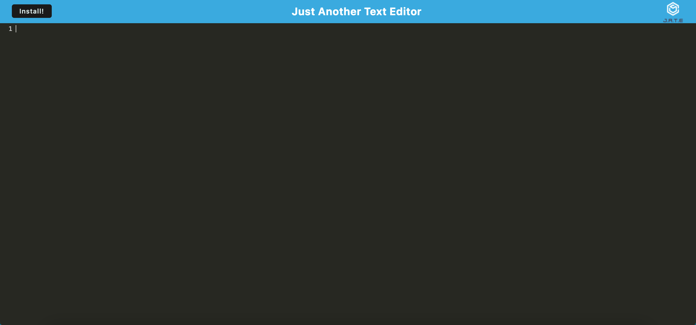
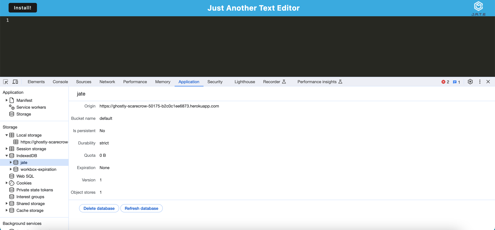
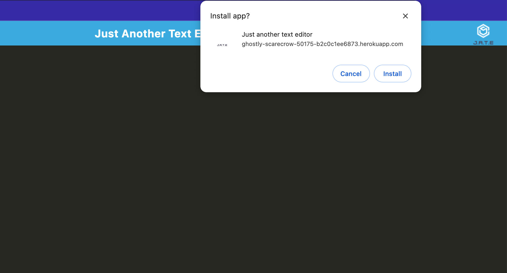

# PWA19

## Link to Heroku deployed app :  https://ghostly-scarecrow-50175-b2c0c1ee6873.herokuapp.com/

## Description
The app is a web text editor the user can create notes with or without internet connection. Utilizing Service worker and cache API's the application is fully functional.

## Table of Contents
- [Installation](#installation)
- [Usage](#usage)
- [License](#license)
- [Contributing](#contributing)
- [Tests](#tests)
- [Questions](#questions)

## Installation
Copy the repo
install necessary packages
execute npm run build
then npm run start for the program to run

## Usage
Frequency,Installation,Contributions and tests.

## License

This project is licensed under the MIT License.

## Contributing
https://github.com/coding-boot-camp/potential-enigma.git

## Tests
trial/error

## Questions
GitHub: [Berrytree5](https://github.com/Berrytree5)
Email: Berrytree93@gmail.com

